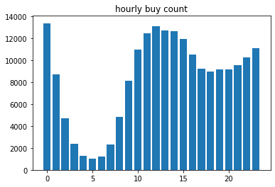
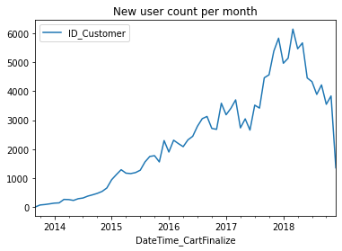
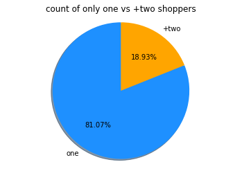
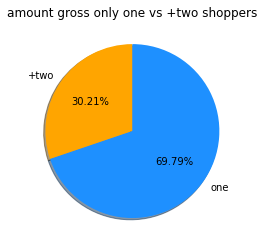
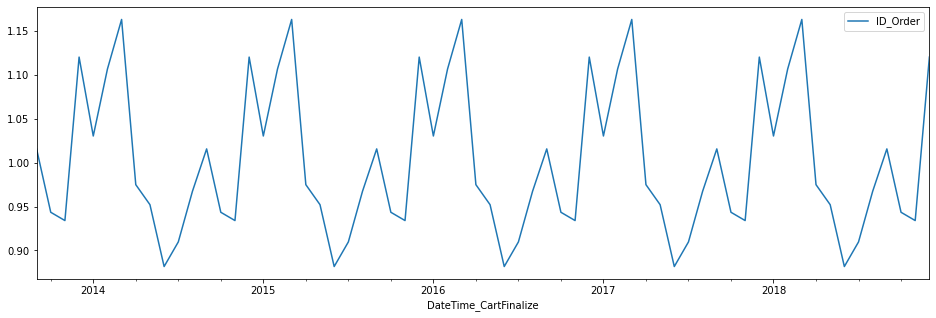

# Analysis on some of Iranian big commercial companies
Here I did some analysis on some big commercial companies. for now just <a href = 'https://digikala.com' target="_blank">Digikala</a> and <a href = 'https://divar.ir' target="_blank">Divar</a>. 

I check the growth of orders and users, share of each city, share of each stuff class. The Analysis has not stoped and I do it periodically.

## Digikala graphs
### which hours people place order most?

this graph illustrates that most people place order near end of night and 12 pm. and the least ordering clock is 5 AM. so maybe 5 AM is best time to manipulate or work on website. and also the workload is the highest in afternoon and end of night, so it need more resources and supports.

 
 

## Growth on new users during time

The above graphs claims that the new users are growing positively during time. But some decreases after 2018 (1397) is happening. Maybe because of bad economic situation or borning new companies!

 
 

## People make only one shop or more? 

 

These pie graphs tells us most people just shop one time! so sell the most stuffs in first time! and also gross amount of customers who shop only once is more than customers who shop more than once.

 

## Seasonal Pattern
